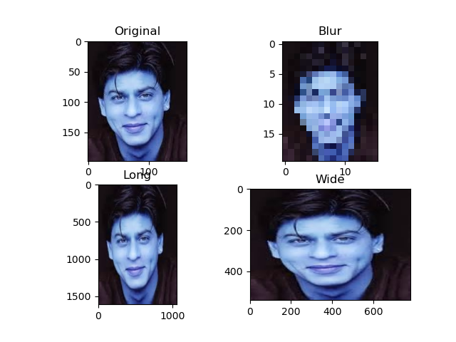

# Python-image-resizing-opencv
The repo contains implementation on image resizing using opencv. The implementation is very simple and easy to learn to get the understanding of how OpenCV can be used in different use cases.

### To get started:
- pip install opencv-python

### Output:

